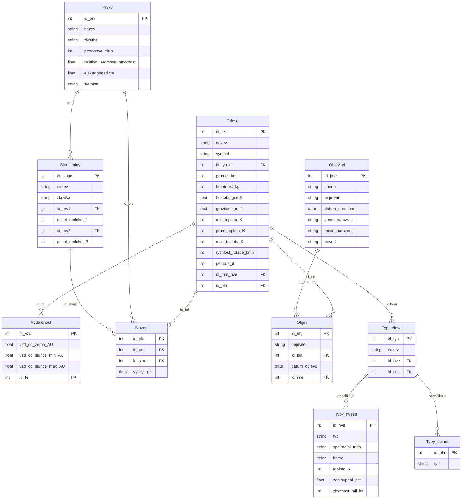

<p align="left">
  
  
  
  
</p>

# 🌌 Cosmic Database (Space Objects)
> This project is a comprehensive **Relational Database Management System (RDBS)** designed to store and analyze astronomical data. It features a robust schema for celestial bodies (planets, stars, moons) including their physical properties, chemical compositions, and discovery history.

The repository demonstrates advanced PostgreSQL capabilities, including:
* **Relational Modeling**: A complex schema representing hierarchical relationships between stars and planets.
* **Advanced SQL**: Recursive queries (CTE) for inheritance, analytical functions, and optimized indices.
* **Database Programming**: Custom PL/pgSQL functions, procedures for transactions, and automated triggers for auditing.
* **ORM Integration**: A Python-based Object-Relational Mapping (ORM) implementation using SQLAlchemy.

## Database Model


## Loading the Database
You can load the database using the provided file **"planety_postgre.sql"**. Simply copy the code into your PostgreSQL database and run it as a script. 
> **Note:** This script is compatible with PostgreSQL only.

## SQL Commands
The following commands were developed as part of a seminar project for the RDBS (Relational Database Systems) course. They are stored in the file **"planety_prikazy_postgre.sql"**.

#### SELECT to Calculate Average Number of Records per Table
```sql
SELECT ROUND(AVG(record_count),0) AS "Average records per table"
FROM (
    SELECT COUNT(*) AS record_count FROM public."Objev"
    UNION ALL
    SELECT COUNT(*) AS record_count FROM public."Objevitel"
    UNION ALL
    SELECT COUNT(*) AS record_count FROM public."Prvky"
    UNION ALL
    SELECT COUNT(*) AS record_count FROM public."Slouceniny"
    UNION ALL
    SELECT COUNT(*) AS record_count FROM public."Slozeni"
    UNION ALL
    SELECT COUNT(*) AS record_count FROM public."Teleso"
    UNION ALL
    SELECT COUNT(*) AS record_count FROM public."Typ_telesa"
    UNION ALL
    SELECT COUNT(*) AS record_count FROM public."Typy_hvezd"
    UNION ALL
    SELECT COUNT(*) AS record_count FROM public."Typy_planet"
    UNION ALL
    SELECT COUNT(*) AS record_count FROM public."Vzdalenost"
) -- Result: 28
```

#### Nested SELECT (Subquery)
Ranks celestial bodies by mass.
```sql
SELECT nazev AS "Body Name",
1 + (SELECT count(*) FROM "Teleso" WHERE "hmotnost_(kg)" > t."hmotnost_(kg)") AS "Mass Rank" 
FROM "Teleso" t
ORDER BY "Mass Rank";
```
#### SELECT with Analytical Function
Calculates the average diameter per planet type.
```sql
SELECT t3.typ AS "Body Type", CONCAT(ROUND(AVG(t1."prumer_(km)")::NUMERIC,0),' ','km') AS "Avg Diameter"
FROM ("Teleso" t1 JOIN "Typ_telesa" t2 ON t1.id_typ_tel = t2.id_typ) 
LEFT JOIN "Typy_planet" t3 ON t2.id_pla = t3.id_pla
WHERE t2.id_pla IS NOT NULL
GROUP BY t3.typ 
ORDER BY AVG(t1."prumer_(km)") DESC
LIMIT 4
```

#### Recursive SELECT (SELF_JOIN)
Hierarchy of Planets and their Moons:

``` sql
with recursive planet_inheritance AS(
  SELECT t.id_pla, (SELECT nazev FROM "Teleso" s WHERE s.id_tel = t.id_pla) AS "Planet Name",
  t.id_tel, t.nazev as "Moon Name"
  FROM "Teleso" t 
  WHERE t.id_pla IS NOT NULL
  UNION 
  SELECT t.id_pla, (SELECT nazev FROM "Teleso" s WHERE s.id_tel = t.id_pla) AS "Planet Name",
  t.id_tel, t.nazev as "Moon Name" 
  FROM "Teleso" t 
  INNER JOIN planet_inheritance d ON d.id_pla = t.id_tel
)
SELECT * FROM planet_inheritance ORDER BY id_pla ASC;
```

#### View
General overview of celestial bodies in the database.
``` sql
CREATE OR REPLACE VIEW Telesa_view AS
SELECT t1.nazev AS "Body Name", t1.symbol AS "Symbol", 
CONCAT(t1."hmotnost_(kg)",' kg') AS "Mass", 
CONCAT(ROUND(t1."prumer_(km)"::numeric,0),' km') AS "Diameter",  
t2.objevitel AS "Discovered By", t3.nazev AS "Body Category", 
CONCAT_WS(' ',t5.typ,t4.typ) AS "Type" 
FROM ("Teleso" t1 JOIN "Objev" t2 ON t1.id_tel = t2.id_pla JOIN "Typ_telesa" t3 ON t1.id_typ_tel = t3.id_typ) 
LEFT JOIN "Typy_planet" t4 ON t3.id_pla = t4.id_pla
LEFT JOIN "Typy_hvezd" t5 ON t3.id_hve = t5.id_hve
ORDER BY id_tel;
```
#### INDEX
Performance optimization example.
``` sql
-- Measure initial performance
explain analyse SELECT t3.typ, t3.id_pla, t1.nazev, t1.id_tel
FROM ("Teleso" t1 JOIN "Typ_telesa" t2 ON t1.id_typ_tel = t2.id_typ) 
LEFT JOIN "Typy_planet" t3 ON t2.id_pla = t3.id_pla
WHERE t3.id_pla IS NOT NULL
ORDER BY t3.id_pla ASC;

-- Create indices
CREATE INDEX index1 ON "Teleso"("id_typ_tel");
CREATE INDEX index2 ON "Typ_telesa"("id_typ","id_pla");
```

### Function -- Average Mass by Object Type
``` sql
CREATE OR REPLACE FUNCTION Vrat_prumernou_hmotnost(druh_telesa text)
returns Table(hmotnost text) AS $$
    select concat(AVG(t1."hmotnost_(kg)"::real),' kg') as "Average mass" 
    from "Teleso" t1 
    join "Typ_telesa" t2 ON t1.id_typ_tel = t2.id_typ 
    where t2.nazev = druh_telesa
$$ language sql;
```

### Procedure -- Gravity Range
Returns a table of bodies within a specific gravity range.

``` sql
CREATE OR REPLACE PROCEDURE Get_gravity(min_grav numeric, max_grav numeric) 
AS $$
-- [Procedure logic included in planety_prikazy_postgre.sql]
-- It creates a temporary table "gravitace_planet" and populates it using a cursor.
```

#### Trigger
Automated auditing for the "Teleso" table. Every insertion is logged into the teleso_action table.

``` sql
CREATE TRIGGER teleso_insert_after
AFTER INSERT ON "Teleso"
FOR EACH ROW
EXECUTE FUNCTION teleso_insert();
```

#### Transactions
A procedure demonstrating safe data transfer (subtracting diameter from one body and adding it to another) with error handling and ROLLBACK capability.

``` sql
CALL change_planet_diameter('Jupiter','Mercury',100000);
-- Use COMMIT to save or ROLLBACK to undo.
```

#### Users and Role management
Examples of creating users, roles, and assigning specific privileges.

```sql
CREATE USER patrik WITH PASSWORD 'patrik123456';
GRANT CONNECT ON DATABASE postgres TO patrik;
CREATE ROLE selecting_role WITH LOGIN PASSWORD 'password';
GRANT SELECT ON TABLE "Teleso" TO selecting_role;
```

#### Locking
Examples of table locking modes (SHARE MODE, ACCESS EXCLUSIVE MODE).
```
BEGIN WORK;
LOCK TABLE "Teleso" in ACCESS EXCLUSIVE MODE;
SELECT * FROM "Teleso" WHERE id_tel = 1;
UPDATE "Teleso" SET "prumer_(km)" = "prumer_(km)" + 100000 WHERE id_tel = 1;
ROLLBACK;
COMMIT WORK;
```

## ORM (Object Relational Mapping)
The project includes a Python implementation using SQLAlchemy and Psycopg2.
The code is located in "orm.py".

**Features:**
- Class-based models for database tables.
- Session management.
- Functions for inserting objects, changing values via transactions, and displaying data.
